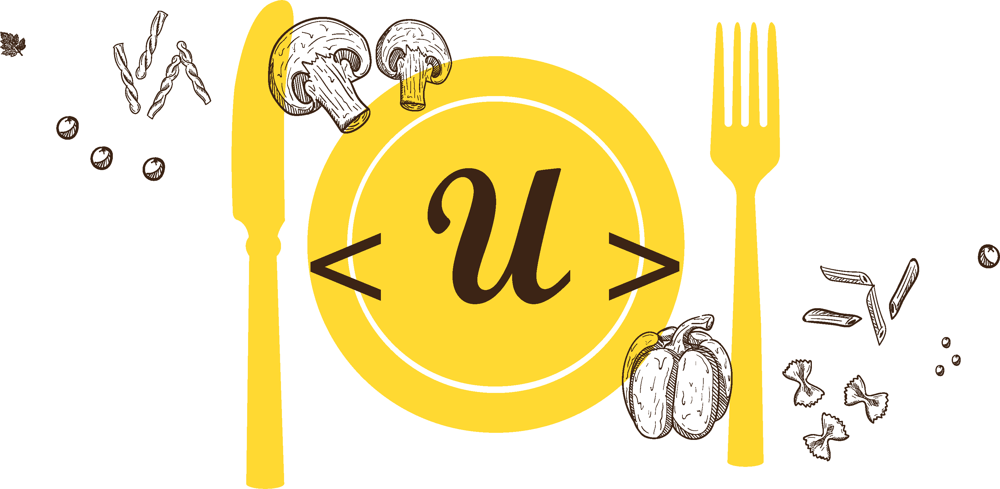
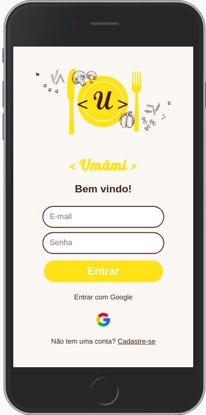
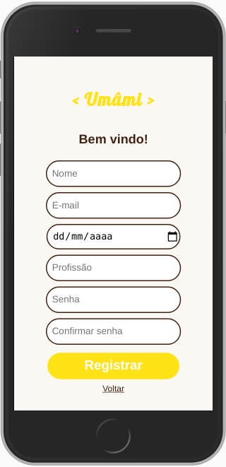
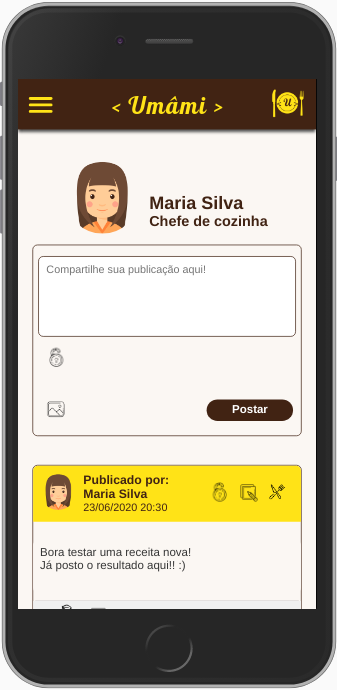
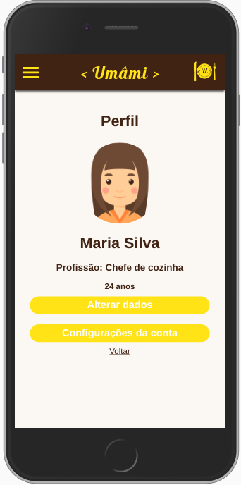
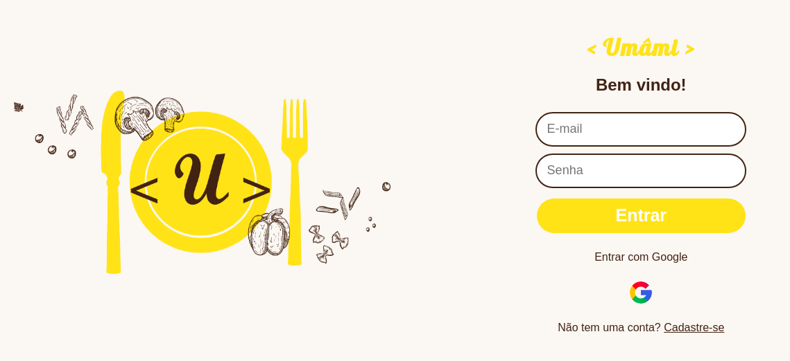
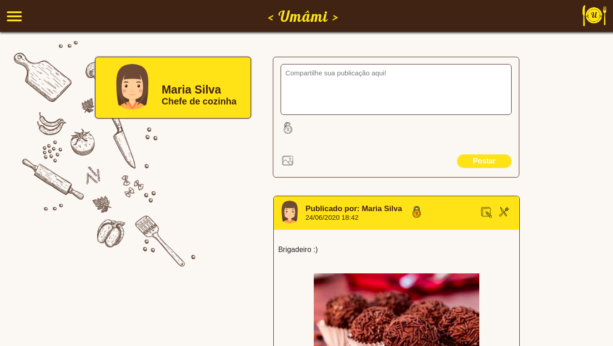
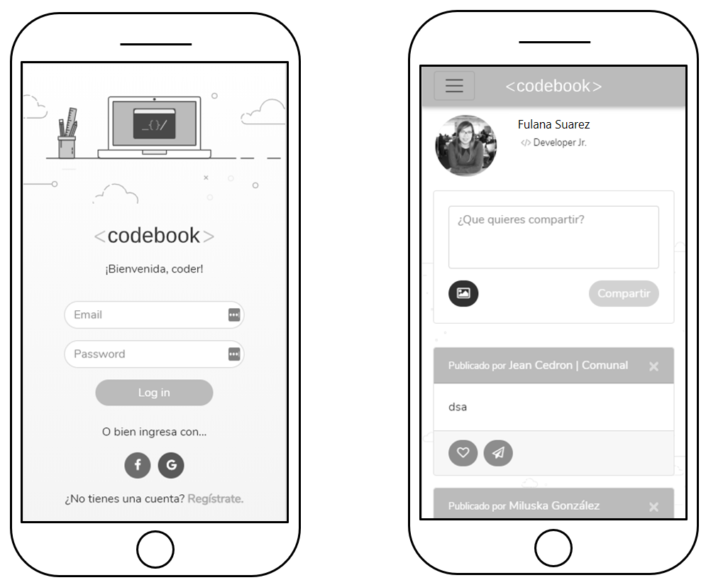
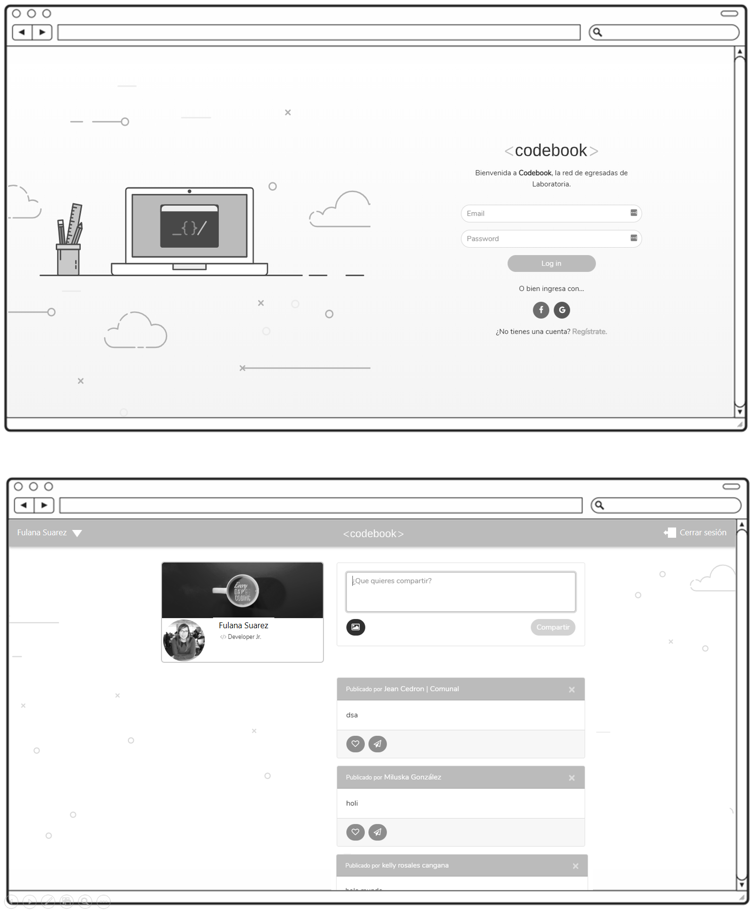
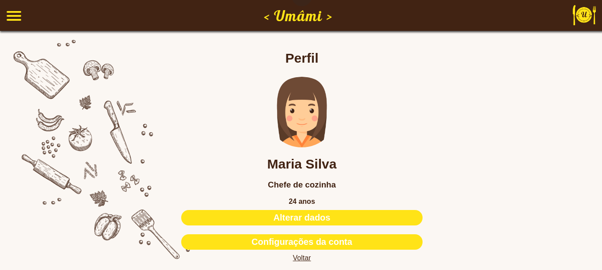

# Umâmi

Para acessar a página [clique aqui](https://social-networt.web.app/). :computer:

<p align='center'>
 
</p>

## Índice

- [1. Introdução](#1-introdução)
- [2. Definições do projeto](#2-definições-do-projeto)
- [3. Desenvolvimento](#3-desenvolvimento)
- [4. Estrutura e funcionalidades](#4-estrutura-e-funcionalidades)
- [5. Considerações técnicas](#5-considerações-técnicas)
- [6. Implementações futuras](#6-implementações-futuras)
- [7. Autoria](#7-autoria)
- [8. Agradecimentos](#8-agradecimentos)

---

## 1. Introdução

O projeto **Umâmi**, se trata de uma rede social com foco em gastronomia :fork_and_knife:.  
Desenvolvida com múltiplas telas (SPA) e persistência de dados, permite ao usuário criar uma conta, postar receitas, posts ou fotos de forma privada ou pública, dar like e comentar nas publicações, além de criar seu perfil, editar ou remover todas essas informações.

<p align='center'>
 
</p>

## 2. Definições do projeto

### Principais usuários

Chefes, aspirantes, cozinheiros amadores e qualquer pessoa que se interesse por culinária.

### Objetivo

Criar uma ambiente onde é possível a troca de experiências culinárias, receitas, aventuras, dicas e achados sobre o mundo gastronômico.

**Objetivo indireto**

O usuário da rede social **Umâmi** pode:

- Se registrar
- Logar
- Postar textos e imagens
- Alterar seu perfil
- Comentar e dar like nas postagens
- Editar e excluir os comentários e postagens
- Mudar sua senha e deletar sua conta

## 3. Desenvolvimento

### Sobre a página

**Umâmi** é um dos cinco gostos básicos do paladar humano, como o ácido, doce, amargo e salgado, e é uma palavra de origem japonesa (うま味?), que significa "gosto saboroso e agradável", o que tem tudo a ver com a aplicação, onde o usuário pode trocar experiências para vivenciar todas essas sensações.  
As cores principais foram escolhidas para trazer a sensação de conforto e acolhimento (marrom) e estimular o apetite (amarelo).

<p align='center'>
    
</p>

<p align='center'>
 
</p>

<p align='center'>
 
</p>

[print timeline]

### Cores

<p align='center'>
 
</p>

### Protótipo

Os protótipos gerais foram previamente fornecidos na descrição do projeto.

- Tela mobile
<p align='center'>
 
</p>

- Tela Desktop
<p align='center'>
 
</p>

### Histórias de Usuário

**História de usuário 01**

> Como usuário novo, devo poder criar uma conta com email e senha válidos para poder iniciar uma sessão e ingressar na Rede Social.

**História de usuário 02**

> Como usuário novo, devo poder ter a opção de iniciar sessão com minha conta do Google para ingressar na Rede Social sem necessidade de criar uma conta de email válido.

**História de usuário 03**

> Como usuário logado devo poder criar, guardar, modificar no mesmo lugar (in place) e deletar publicações (post) privadas ou públicas.

**História de usuário 04**

> Como usuário logado devo poder ver todos os posts públicos e privados que criei até o momento, do mais recente para o mais antigo, assim como a opção de trocar a configuração de privacidade dos meus posts.

**História de usuário 05**

> Eu como usuário logado, posso dar like e ver a contagem de likes em minhas publicações

**História de usuário 06**

> Eu como usuário logado, posso escrever, salvar, editar ou deletar um comentário em minhas publicações.

**História de usuário 07**

> Eu como usuário logado, posso visualizar os dados de meu perfil criado, editá-los e incluir minha foto de perfil.

**História de usuário 08**

> Eu como usuário logado, posso adicionar fotos aos meus posts.

Todas as histórias implementadas levam em consideração _critérios de aceitação_ e _definições de pronto_.

## 4. Estrutura e funcionalidades

A aplicação possui 4 telas: login, registro, linha do tempo e perfil, onde:

- O usuário pode logar com email e senha, e pelo Google.
- Também pode se registrar como um novo usuário.

Como usuário logado é permitido:

- Visualizar todos os posts em ordem cronológica.
- Fazer post públicos e privados, com texto e imagens.
- Editar, excluir e alterar a privacidade dos posts.
- Dar _like_ e comentar nas postagens.
- Editar e excluir os comentários.

No seu perfil é permitido:

- Visualizar e alterar seus dados pessoais (nome, foto, profissão, data de nascimento, email e senha).
- Deletar sua conta.

<p align='center'>
 
</p>

## 5. Considerações técnicas

Para a construção do site foi utilizado o software _Visual Studio Code_ com _NPM_ e _Git_.  
Sua marcação foi feita em _HTML5_ utilizando tags semânticas e sistema de rotas.  
Sua estilização foi feita em _CSS3_ utilizando o conceito de mobile first e utilizando flexbox para o posicionamento dos elementos.  
Foi utilizado o vanilla _JavaScript_ na manipulação dos dados, funções assíncronas, manipulação do DOM, modularização, uso de callbacks, consumo de promises e template strings, levando em conta a separação de responsabilidade nos arquivos e criação de elementos.  
A manipulação e persistência dos dados foi feita com Firebase através de um banco de dados não relacional, em tempo real, implementando operações CRUD (Criação, Leitura, Atualização e Remoção) de dados.
_[Firebase](https://firebase.google.com/)_ (Hosting, Auth, Database e Firestore).  
Colaboração e armazenamento com _GitHub_.  
Organização com _Trello_.  
Interface hospedada usando _Firebase Hosting_.

### Instalação e execução. :octocat:

- [Clone](https://help.github.com/articles/cloning-a-repository/) o projeto na sua máquina executando o seguinte comando no seu terminal:

```sh
git clone (link-do-repositório)
```

- Instale as dependências do projeto com o comando:

```sh
npm install
```

- Rode o projeto na sua máquina com:

```sh
npm start
```

- E visualize o projeto no seu navegador com o link:

```sh
http://localhost:5000
```

## 6. Implementações futuras

Futuramente serão implementadas funcionalidades para melhoria da experiência do usuário:

- Compartilhar as publicações.
- Salvar publicações.
- Pesquisar por hashtags e usuários.
- Curtir comentários.
- Seguidores e seguir.
- Implementar a página de perfil.
- Incluir vídeos nos posts.
- Implementar stories (vídeos e fotos).
- Visualizar usuários que curtiram.
- Visualizar os próprios posts no perfil.
- Sugestões de amizade e postagens.
- Marcar usuários nos posts.
- Explorar posts.

## 7. Autoria

Este projeto foi feito por [Camila Cunha](https://github.com/camilagerarde), [Gabriela Piovezan](https://github.com/gabrielapiovezan) e [Mariana Barros](https://github.com/MarianaMBarros) com base no projeto da [Laboratoria](https://github.com/Laboratoria).

## 8. Agradecimentos

- [Laboratoria](https://github.com/Laboratoria).
- Ícones e vetores: [Freepik](https://www.flaticon.com/br/autores/freepik), [Pixel Perfect](https://www.flaticon.com/br/autores/pixel-perfect) e [Those Icons](https://www.flaticon.com/br/autores/those-icons).
